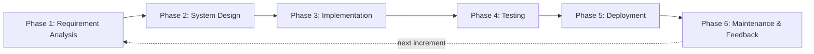
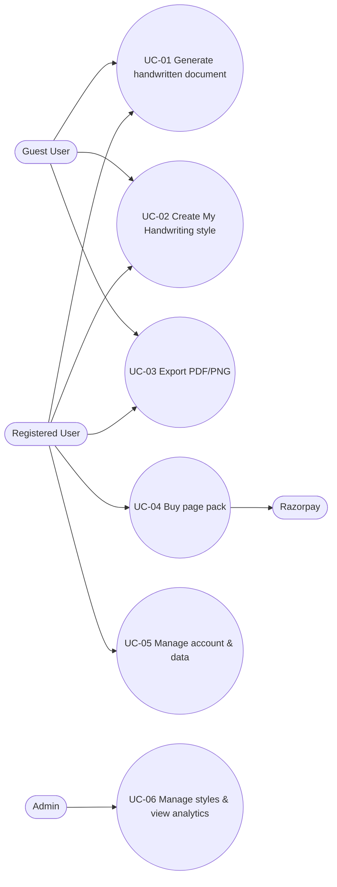

# Phase 1 — Requirement Analysis (SRS)

**Project:** AI Text-to-Handwriting SaaS (working title: *Likhawat*, final name after domain/trademark check)
**SDLC phase:** 1 of 6 — Requirement Analysis
**Document version:** 1.0
**Date:** 25 September 2026
**Prepared by:** _[Your Name]_
**Status:** Draft, pending sign-off

---

## Table of Contents

1. [SDLC Model Used](#1-sdlc-model-used)
2. [Introduction](#2-introduction)
3. [Problem Statement](#3-problem-statement)
4. [Market & Competitor Analysis](#4-market--competitor-analysis)
5. [Stakeholders & User Personas](#5-stakeholders--user-personas)
6. [Requirement Gathering Methods](#6-requirement-gathering-methods)
7. [Functional Requirements](#7-functional-requirements)
8. [Non-Functional Requirements](#8-non-functional-requirements)
9. [Use Cases](#9-use-cases)
10. [Proposed Pricing Model](#10-proposed-pricing-model)
11. [Feasibility Study](#11-feasibility-study)
12. [Assumptions & Constraints](#12-assumptions--constraints)
13. [Risks & Mitigation](#13-risks--mitigation)
14. [Validation Gate & Acceptance Criteria](#14-validation-gate--acceptance-criteria)
15. [Out of Scope (v1)](#15-out-of-scope-v1)
16. [Requirements Traceability Matrix](#16-requirements-traceability-matrix)
17. [Next Phase: System Design](#17-next-phase-system-design)
18. [Glossary](#18-glossary)
19. [References](#19-references)
20. [Sign-off](#20-sign-off)

---

## 1. SDLC Model Used

**Model chosen: Incremental model.** Each increment goes through all six SDLC phases in order.

| Increment | Scope | Goal |
|---|---|---|
| **Increment 1 (MVP)** | English text to handwriting, built-in styles, variation engine, *My Handwriting* (custom style from photo), paper styles, PDF/PNG export, guest mode | Prove output quality and user demand |
| **Increment 2** | Accounts, credits, INR payments (UPI), Hindi (Devanagari), assignment header, scan/photo effect | Start earning revenue |
| **Increment 3** | Diagrams/images, more Indian languages, admin analytics, SEO use-case pages | Grow traffic and retention |
| **Increment 4 (future)** | B2B: API, bulk CSV merge, Shopify app, pen-plotter (SVG stroke) output | Higher-value business customers |

**Why Incremental and not pure Waterfall:**
- This is a side project with limited time. A usable product is released early and improved with real feedback.
- Market demand is still unproven. A validation gate after Increment 1 (see §14) decides whether to invest more time.
- Requirements such as pricing and Hindi support may change after user feedback. The incremental model absorbs these changes without redoing the whole project.

---

## 2. Introduction

### 2.1 Purpose
This document records the requirements of a web-based SaaS product that converts typed text into realistic handwritten pages. It is the input for the System Design phase and the baseline for testing and acceptance.

### 2.2 Product Scope
Users type or paste text, choose a handwriting style (or create one from their own handwriting), choose a paper style, and download a realistic handwritten document as PDF or images. The main users are **students who need handwritten-style assignments, notes and practical files**. Secondary users are teachers, individuals writing personal letters, and, in the future, small businesses.

### 2.3 Intended Audience
Project owner/developer, project guide/evaluator (if submitted as an academic project), future collaborators and testers.

### 2.4 Definitions
See [§18 Glossary](#18-glossary).

---

## 3. Problem Statement

Students in India are often asked to submit assignments, notes and practical/lab files **by hand**. Writing long content by hand takes hours. Existing online "text to handwriting" tools have these problems:

1. **Output looks fake.** Most tools render a fixed font, so every "a" looks identical, lines are perfectly straight, and the page is clearly computer-generated.
2. **Personal handwriting is hard.** Tools that allow a custom font require the user to create a font file elsewhere first (e.g., with Calligraphr, $8/month).
3. **Weak Indian-language support.** Font-based Hindi (Devanagari) output looks unnatural, especially matras and conjunct letters.
4. **Pricing does not suit Indian students.** Paid tools charge USD monthly subscriptions ($3.99–$9.99/month). Students prefer small one-time UPI payments.
5. **Poor quality of free tools.** Free tools are ad-heavy, have high bounce rates, and offer few assignment-specific features (name/roll-number header, page numbers, practical-file layout).

**Opportunity:** a tool that produces *genuinely natural-looking* handwriting, lets users create their *own* handwriting style from one photo, supports Hindi, and is priced in small INR packs.

---

## 4. Market & Competitor Analysis

### 4.1 Market Signals

| Signal | Data | Source |
|---|---|---|
| Leading B2C competitor traffic | handtextai.com: ~210K visits/month (Mar 2026), +71% month-on-month, 64.5% from Google organic, top country India | Semrush |
| Smaller competitor traffic | texttohandwriting.in: ~65K visits/month (Apr 2026), 81% bounce rate, authority score 13 | Semrush/Similarweb |
| Older competitor declining | texttohandwriting.com: global rank fell from ~125K to ~173K in 3 months | Similarweb |
| Number of competitors | 15+ similar tools, including one free open-source project | Web search |
| B2B handwritten mail | Handwrytten: ~$3.5M revenue, 32 employees, 175 robots, 6M+ notes | Latka, Handwrytten |
| B2B pricing | $0.97–$18 per handwritten card across 14 providers | Simply Noted pricing guide |
| Direct mail growth (US) | 25.4B pieces sent in the first 9 months of 2025, +11.9% year-on-year | Scribe (citing Franklin Madison) |

**Conclusion:** B2C demand exists and is concentrated in India, but the market is fragmented and mostly free. Revenue comes from **quality differentiation + small INR payments**. B2B has much higher value per unit and is kept for a later increment.

### 4.2 Competitor Feature Comparison

| Feature | texttohandwriting.in | HandtextAI | Other free clones | **Our product (target)** |
|---|---|---|---|---|
| Price | Free, ads | Free 5 pages; $3.99–$9.99/month | Free, ads | Free daily quota + ₹ packs |
| Handwriting styles | Few fonts | 90 fonts | Few fonts | Built-in styles **with natural variation** |
| Per-letter variation | ❌ | ❌ (font-based) | ❌ | ✅ multiple variants + jitter |
| Custom handwriting | Upload font file | Upload font file | Rare | ✅ **Create directly from one photo** |
| Hindi (Devanagari) | ❌ | ✅ (font-based) | Rare | ✅ natural matras/conjuncts (Increment 2) |
| Paper styles | Lined, grid, plain | 3+ types | Some | Ruled notebook, grid, plain, practical file |
| Assignment header / page numbers | ❌ | Partial | ❌ | ✅ |
| Scan/photo realism effect | ❌ | Partial | Rare | ✅ |
| Local payments (UPI) | N/A | ❌ (USD) | N/A | ✅ |
| API / B2B | ❌ | ✅ | ❌ | Increment 4 |

### 4.3 Unique Selling Points (USP)
1. **Natural variation engine:** no two instances of the same letter look identical.
2. **"My Handwriting" in 1 minute:** write on a template sheet, upload a photo, get a personal style.
3. **India-first:** Hindi support, practical-file layouts, UPI micro-payments.

---

## 5. Stakeholders & User Personas

### 5.1 Stakeholders

| Stakeholder | Interest |
|---|---|
| Students (school & college) | Save time on handwritten submissions; realistic output; low price |
| Teachers / tutors | Create handwritten-style worksheets and notes |
| Individuals | Personal letters, greeting cards, journals |
| Small businesses (future) | Handwritten thank-you notes, greetings at scale |
| Project owner | Side income, portfolio/academic project |
| Payment gateway (Razorpay) | Compliant transactions |

### 5.2 Personas

**P1 — Engineering student (primary)**
- 2nd-year B.Tech student, uses a mid-range Android phone.
- Has 3–4 practical files and assignments due each month.
- Budget: can spend ₹50–100 occasionally, will not pay a USD subscription.
- Needs: fast output, ruled-notebook look, name/roll-number header, PDF to print.

**P2 — Hindi-medium school student**
- Class 11 student with Hindi assignments.
- Needs: Hindi handwriting that looks natural, simple UI, works on mobile.

**P3 — Teacher / tutor**
- Makes notes and worksheets for coaching classes.
- Needs: neat handwriting style, diagrams, multi-page PDF.

**P4 — Individual user**
- Wants to send a handwritten-style letter or card.
- Needs: own handwriting style, decorative paper, high-resolution image.

---

## 6. Requirement Gathering Methods

| Method | Status | Output |
|---|---|---|
| Competitor analysis (features, pricing, traffic) | ✅ Done | §4 |
| Web and market research | ✅ Done | §4.1 |
| Student survey (Google Form, 50+ responses, via college WhatsApp/Telegram groups) | ⏳ Planned | Confirms features & price |
| User interviews (8–10 students, 2–3 teachers) | ⏳ Planned | Pain points, workflow |
| Landing page + waitlist | ⏳ Planned | Demand signal (§14) |
| Blind test of output quality | ⏳ Planned | Quality signal (§14) |

**Suggested survey questions:**
1. How many handwritten assignments/practical files do you submit per month?
2. How many hours does one assignment take to write by hand?
3. Have you used any text-to-handwriting tool? Which one? What did you dislike?
4. Would you use a tool that writes in *your own* handwriting?
5. Do you need Hindi or another Indian language?
6. How much would you pay for 30 pages? (₹0 / ₹29 / ₹49 / ₹99)
7. Do you use this on phone or laptop?

---

## 7. Functional Requirements

**Priority (MoSCoW):** **M** = Must have, **S** = Should have, **C** = Could have, **W** = Won't have in this release.
**Inc** = planned increment.

### 7.1 Module M1 — Text Input & Editor

| ID | Requirement | Priority | Inc |
|---|---|---|---|
| FR-01 | The user shall type or paste text up to 10,000 characters per document. | M | 1 |
| FR-02 | The system shall preserve paragraphs, line breaks and bullet/numbered lists. | M | 1 |
| FR-03 | The user shall mark text as heading (larger size) or underlined (hand-drawn underline). | S | 2 |
| FR-04 | The system shall auto-save the current draft in the browser. | S | 1 |
| FR-05 | The user shall import text from .txt and .docx files. | C | 3 |

### 7.2 Module M2 — Handwriting Styles & Variation Engine

| ID | Requirement | Priority | Inc |
|---|---|---|---|
| FR-06 | The system shall provide at least 8 built-in handwriting styles (print and cursive). | M | 1 |
| FR-07 | The system shall show a live preview when the user changes style or settings. | M | 1 |
| FR-08 | Each character shall have at least 2 glyph variants (3 for custom styles). The engine shall pick variants randomly and avoid repeating the same variant for the same letter back-to-back. | M | 1 |
| FR-09 | The engine shall add natural irregularities: baseline wobble, small rotation, size and spacing variation. A "neat ↔ messy" slider shall control the amount. | M | 1 |
| FR-10 | The user shall choose ink colour (blue, black, red, custom). The engine shall vary ink density slightly along strokes. | M | 1 |

### 7.3 Module M3 — My Handwriting (Custom Style)

| ID | Requirement | Priority | Inc |
|---|---|---|---|
| FR-11 | The user shall download a printable A4 template sheet with corner markers and boxes for A–Z, a–z, 0–9 and common punctuation, each repeated 3 times. | M | 1 |
| FR-12 | The user shall upload a photo or scan of the filled sheet (JPG/PNG/PDF, max 10 MB). | M | 1 |
| FR-13 | The system shall detect the sheet, correct perspective, crop each box and remove the background. | M | 1 |
| FR-14 | The system shall show the extracted characters. The user can delete or replace bad characters, or re-upload the sheet. | S | 1 |
| FR-15 | The system shall check photo quality (blur, lighting, missing markers) and show clear guidance on failure. | S | 1 |
| FR-16 | The system shall save the custom style for reuse (guest: current session; logged-in user: account). | M | 1 |
| FR-17 | The user shall export the custom style as a TTF/OTF font file. | C | 3 |

### 7.4 Module M4 — Page & Layout

| ID | Requirement | Priority | Inc |
|---|---|---|---|
| FR-18 | The user shall choose paper: ruled notebook (with margin line), grid, plain, practical-file layout; and paper colour. | M | 1 |
| FR-19 | The system shall support A4 page size. | M | 1 |
| FR-20 | The user shall adjust font size, line spacing and margins. Text shall sit on the ruled lines. | M | 1 |
| FR-21 | The system shall paginate long text automatically across multiple pages. | M | 1 |
| FR-22 | The user shall add an assignment header (name, roll no., subject, date) and page numbers. | S | 2 |
| FR-23 | The user shall insert images/diagrams at a chosen position. | C | 3 |
| FR-24 | The system shall render math expressions in handwriting. | W | — |

### 7.5 Module M5 — Realism Effects

| ID | Requirement | Priority | Inc |
|---|---|---|---|
| FR-25 | The user shall apply a "scanned/photo" effect: paper texture, lighting gradient, light shadow and noise. | S | 2 |
| FR-26 | The user shall toggle occasional natural corrections (e.g., a struck-out word). | C | 3 |

### 7.6 Module M6 — Export

| ID | Requirement | Priority | Inc |
|---|---|---|---|
| FR-27 | The user shall download all pages as one PDF. | M | 1 |
| FR-28 | The user shall download each page as PNG/JPG, or all pages as a ZIP. | M | 1 |
| FR-29 | Free exports shall be standard quality (150 DPI). Paid exports shall be HD (300 DPI). | S | 2 |
| FR-30 | Output shall print correctly on A4 without scaling issues. | M | 1 |

### 7.7 Module M7 — User Accounts

| ID | Requirement | Priority | Inc |
|---|---|---|---|
| FR-31 | A guest shall use the free quota without signing up. | M | 1 |
| FR-32 | The user shall sign up / log in with Google or email OTP. | M | 2 |
| FR-33 | The user shall see a dashboard with saved documents, custom styles, credit balance and invoices. | S | 2 |
| FR-34 | The user shall delete their account and all related data (including handwriting samples). | M | 2 |

### 7.8 Module M8 — Pricing & Payments

| ID | Requirement | Priority | Inc |
|---|---|---|---|
| FR-35 | The system shall enforce a free daily page quota per user/device. | M | 1 |
| FR-36 | The user shall buy page packs in INR via UPI, cards and net banking (Razorpay). | M | 2 |
| FR-37 | The system shall deduct credits per exported page and show the remaining balance. | M | 2 |
| FR-38 | The system shall generate invoices for purchases (GST-compliant once registration applies). | S | 2 |
| FR-39 | The system shall support coupon codes and referral credits. | C | 3 |

### 7.9 Module M9 — Languages

| ID | Requirement | Priority | Inc |
|---|---|---|---|
| FR-40 | The system shall support English (Latin script). | M | 1 |
| FR-41 | The system shall support Hindi (Devanagari), including matras and conjunct letters. | S | 2 |
| FR-42 | The system shall support other Indian languages (Marathi, Gujarati, Bengali, Tamil, etc.). | C | 3 |
| FR-43 | The interface shall be available in English and Hindi. | C | 3 |

### 7.10 Module M10 — Admin & Analytics

| ID | Requirement | Priority | Inc |
|---|---|---|---|
| FR-44 | The system shall record analytics events (visits, generations, exports, sign-ups, purchases). | M | 1 |
| FR-45 | The admin shall view users, revenue, pages generated and failed jobs. | S | 3 |
| FR-46 | The admin shall add/edit built-in styles and paper templates without code changes. | S | 3 |

### 7.11 Module M11 — B2B (future)

| ID | Requirement | Priority | Inc |
|---|---|---|---|
| FR-47 | REST API for generating handwritten pages. | W | 4 |
| FR-48 | Bulk generation from CSV with variables (name, address, message). | W | 4 |
| FR-49 | Shopify app for automatic thank-you notes per order. | W | 4 |
| FR-50 | SVG stroke output for pen plotters (real-pen writing). | W | 4 |

---

## 8. Non-Functional Requirements

| ID | Category | Requirement |
|---|---|---|
| NFR-01 | Performance | Preview updates within 1 s for one page; a 10-page PDF exports within 10 s; custom style processing completes within 60 s. |
| NFR-02 | Scalability | Handle 500 concurrent users and 50,000 pages/day without redesign. |
| NFR-03 | Availability | 99% monthly uptime. |
| NFR-04 | Usability | Mobile-first. A new user generates the first page within 60 s and 3 steps, without sign-up. |
| NFR-05 | Compatibility | Latest 2 versions of Chrome, Edge, Firefox, Safari; Android Chrome and iOS Safari; screens from 360 px wide. |
| NFR-06 | Security | HTTPS everywhere; OWASP Top 10 protections; rate limiting; uploaded files validated by type and size and processed in isolation; card data never stored (handled by Razorpay). |
| NFR-07 | Privacy | Handwriting samples are personal data. Collect explicit consent, store encrypted, allow deletion, auto-delete guest documents after 24 h. Comply with India's Digital Personal Data Protection Act, 2023. |
| NFR-08 | Cost | Infrastructure ≤ ₹2,000/month until 1,000 paying users. v1 rendering runs on CPU (no GPU). |
| NFR-09 | SEO | Server-side rendered public pages; good Core Web Vitals (LCP < 2.5 s). |
| NFR-10 | Maintainability | Rendering engine is a separate module with ≥ 70% unit-test coverage; CI runs tests on every push. |
| NFR-11 | Accessibility | UI meets WCAG 2.1 AA (contrast, keyboard navigation, labels). |
| NFR-12 | Output quality | In a blind test, ≥ 70% of people judge the output as real handwriting (see §14). |
| NFR-13 | Localisation | Prices in INR, dates in Indian format, IST time zone. |
| NFR-14 | Licensing | All built-in fonts/assets are licensed for commercial use (e.g., SIL Open Font License). |

---

## 9. Use Cases

### 9.1 Use Case Diagram

### 9.2 Use Case Descriptions

**UC-01 — Generate handwritten document**
- **Actor:** Guest or registered user
- **Precondition:** None
- **Main flow:**
  1. User opens the app and pastes text.
  2. User selects handwriting style, paper, ink colour, size and spacing.
  3. System shows a live preview with natural variation.
  4. User proceeds to export (UC-03).
- **Alternate flows:**
  - Text exceeds 10,000 characters → system asks the user to split the document.
  - Unsupported characters (e.g., emoji) → system skips them and warns the user.

**UC-02 — Create "My Handwriting" style**
- **Actor:** Guest or registered user
- **Precondition:** User has a printer or can copy the template onto paper
- **Main flow:**
  1. User downloads the template sheet.
  2. User fills it with a pen and takes a photo.
  3. User uploads the photo.
  4. System corrects perspective, extracts characters and shows them.
  5. User reviews and confirms.
  6. System saves the style and applies it to the preview.
- **Alternate flows:**
  - Photo blurred or markers not found → system shows tips and asks for a new photo.
  - Some boxes are empty → system uses a matching built-in style for the missing characters and informs the user.

**UC-03 — Export document**
- **Actor:** Guest or registered user
- **Precondition:** A preview exists
- **Main flow:**
  1. User clicks Download and chooses PDF, PNG or ZIP.
  2. System checks the quota or credit balance.
  3. System renders the pages and starts the download.
  4. System deducts pages from the quota/credits.
- **Alternate flow:** Quota exhausted → system offers login and page packs (UC-04).

**UC-04 — Buy page pack**
- **Actor:** Registered user; Razorpay
- **Main flow:**
  1. User selects a pack.
  2. System creates a Razorpay order.
  3. User pays via UPI/card.
  4. Razorpay confirms payment via webhook.
  5. System adds credits and generates an invoice.
- **Alternate flow:** Payment fails or is cancelled → no credits added; user can retry.

**UC-05 — Manage account & data**
- **Actor:** Registered user
- **Main flow:** View documents, styles, credits and invoices; delete a style; delete the account (all data removed).

**UC-06 — Manage styles & analytics**
- **Actor:** Admin
- **Main flow:** Add or edit built-in styles and paper templates; view users, revenue, usage and failed jobs.

### 9.3 Key User Stories
- As a **student**, I want to paste my assignment and get a ruled-notebook PDF so that I can print and submit it quickly.
- As a **student**, I want the output in **my own handwriting** so that it matches my other work.
- As a **Hindi-medium student**, I want natural Hindi handwriting so that my Hindi assignments look right.
- As a **student on a budget**, I want to pay ₹49 via UPI for a pack instead of a USD subscription.
- As a **teacher**, I want neat handwritten worksheets with diagrams so that my notes feel personal.

---

## 10. Proposed Pricing Model

To be confirmed by the survey and pre-order test (§14).

| Plan | Price (proposed) | Includes |
|---|---|---|
| Free | ₹0 | 5 pages/day, built-in styles, standard quality, no watermark |
| Mini pack | ₹49 | 30 pages, HD export, 1 custom handwriting style |
| Semester pack | ₹149 | 150 pages, HD, 3 custom styles, Hindi, scan effect |
| Unlimited monthly | ₹199/month | Unlimited pages, all features |

**Note:** competitors offer watermark-free free tiers, so a watermark on free pages is not recommended.

---

## 11. Feasibility Study

| Type | Assessment | Result |
|---|---|---|
| **Technical** | Needed tools are mature and open source: OpenCV (sheet detection, cropping), Potrace (vectorising), fontTools/FontForge (font files), HarfBuzz (Hindi text shaping), PDF libraries. Hard parts: varying photo quality, Devanagari conjuncts, fast multi-page rendering. | ✅ Feasible |
| **Economic** | Start-up cost < ₹5,000 (domain ~₹1,000/year, basic hosting ₹0–2,000/month). Payment gateway fee ~2% per transaction (check current Razorpay rates). Monthly costs are covered by ~20–40 paid packs. | ✅ Feasible |
| **Operational** | Built and run by one developer at 10–15 hours/week. Mostly self-service; minimal support needed. | ✅ Feasible |
| **Legal** | Privacy policy and consent (DPDP Act 2023); Terms of Service; commercial font licences; GST registration once turnover crosses the applicable threshold. | ✅ Feasible with care |
| **Schedule** | Increment 1 in ~6 weeks; Increment 2 by ~week 10. | ✅ Feasible |

---

## 12. Assumptions & Constraints

**Assumptions**
- Most target users use smartphones and access the product in a mobile browser.
- Users can print the template sheet, or copy its layout by hand onto plain paper.
- Students prefer small one-time payments over subscriptions.
- Organic search (SEO) and social media are the main acquisition channels; no large ad budget.

**Constraints**
- Solo developer with limited weekly hours.
- Infrastructure budget ≤ ₹2,000/month initially.
- v1 must run on CPU only; no GPU-based AI model.
- Preliminary technology preference (final decision in System Design): Next.js frontend, Python (FastAPI) backend for image processing, Razorpay payments.

---

## 13. Risks & Mitigation

| # | Risk | Likelihood | Impact | Mitigation |
|---|---|---|---|---|
| R1 | Output does not look better than competitors | Medium | High | Blind test before full build (§14); focus effort on the variation engine |
| R2 | Low willingness to pay | High | High | Pre-order test; low INR price points; generous free tier to build traffic |
| R3 | Hard to rank on Google against established sites | High | Medium | Target long-tail keywords first (e.g., "Hindi handwriting generator", "practical file generator"); share demo videos on Instagram/YouTube Shorts |
| R4 | Poor-quality user photos break custom style creation | Medium | Medium | Corner markers, quality checks, clear photo tips, per-character correction |
| R5 | **Academic integrity:** some institutions treat submitting generated handwriting as misconduct | Medium | Medium | ToS asks users to follow their institution's rules; market the product for notes, practice, letters and time-saving, not "undetectable cheating"; avoid wording that violates ad-platform policies |
| R6 | Privacy breach of handwriting samples | Low | High | Encryption, minimal retention, easy deletion, DPDP compliance |
| R7 | Devanagari rendering complexity delays Increment 2 | Medium | Medium | Ship English first; Hindi as a separate increment |
| R8 | Competitors copy features | Medium | Low | Move fast; build brand in the Indian student niche; later expand to B2B |

---

## 14. Validation Gate & Acceptance Criteria

Before investing beyond Increment 1, the project must pass this gate:

| Test | Pass criterion | If failed |
|---|---|---|
| Blind quality test | ≥ 70% of 15–20 people judge our output as real handwriting | Improve the engine before building further |
| Landing page + waitlist | ≥ 100 sign-ups from ~2,000 visitors | Rethink positioning or stop |
| Pre-order / price test | ≥ 10 paid pre-orders (₹49) | Revisit pricing or stop |
| Survey | ≥ 50 responses; majority confirm the pain point | Revisit target users |

**Acceptance criteria for Increment 1:**
- All **Must** requirements for Increment 1 pass their test cases.
- NFR-01, NFR-04, NFR-05 and NFR-12 are met.
- No critical or high-severity bugs are open.

---

## 15. Out of Scope (v1)

- Native Android/iOS apps (the web app is mobile-responsive).
- Physical printing, posting or robotic pen writing.
- AI-generated assignment content. The tool only converts text the user provides.
- Math/LaTeX rendering and full diagram tools.
- B2B API, bulk CSV, Shopify integration (Increment 4).

---

## 16. Requirements Traceability Matrix

Test case IDs are filled in during the Testing phase.

| Requirement | Module | Increment | Design ref. | Test case |
|---|---|---|---|---|
| FR-01 – FR-05 | M1 Text Input | 1–3 | TBD | TBD |
| FR-06 – FR-10 | M2 Styles & Variation | 1 | TBD | TBD |
| FR-11 – FR-17 | M3 My Handwriting | 1–3 | TBD | TBD |
| FR-18 – FR-24 | M4 Page & Layout | 1–3 | TBD | TBD |
| FR-25 – FR-26 | M5 Realism | 2–3 | TBD | TBD |
| FR-27 – FR-30 | M6 Export | 1–2 | TBD | TBD |
| FR-31 – FR-34 | M7 Accounts | 1–2 | TBD | TBD |
| FR-35 – FR-39 | M8 Payments | 1–3 | TBD | TBD |
| FR-40 – FR-43 | M9 Languages | 1–3 | TBD | TBD |
| FR-44 – FR-46 | M10 Admin | 1–3 | TBD | TBD |
| FR-47 – FR-50 | M11 B2B | 4 | TBD | TBD |
| NFR-01 – NFR-14 | Cross-cutting | 1+ | TBD | TBD |

---

## 17. Next Phase: System Design

Deliverables for Phase 2:
1. High-level architecture diagram (frontend, API, rendering engine, image-processing worker, storage, payments).
2. Rendering engine design (glyph storage, variant selection, jitter model, pagination, PDF output).
3. Custom-style pipeline design (template spec, marker detection, cropping, cleaning, vectorising).
4. Database schema (users, documents, styles, glyphs, credits, orders, events).
5. API specification.
6. UI wireframes (editor, preview, My Handwriting flow, pricing, dashboard).
7. Final technology stack and hosting decision.

---

## 18. Glossary

| Term | Meaning |
|---|---|
| Glyph | The drawn shape of one character |
| Variant | One of several different drawings of the same character |
| Baseline | The imaginary line text sits on |
| Jitter | Small random changes in position, size or rotation |
| DPI | Dots per inch, a measure of image resolution |
| SSR | Server-side rendering, which helps SEO |
| MoSCoW | Must / Should / Could / Won't prioritisation |
| DPDP Act | India's Digital Personal Data Protection Act, 2023 |
| B2C / B2B | Business-to-consumer / business-to-business |
| Pen plotter | A machine that moves a real pen to draw vector paths |

---

## 19. References

- HandtextAI traffic — https://www.semrush.com/website/handtextai.com/overview/
- HandtextAI pricing — https://www.saasworthy.com/product/handtextai/pricing
- HandtextAI features — https://ai.g2.com/marketplace/tools/handtextai
- texttohandwriting.in — https://texttohandwriting.in/
- texttohandwriting.in traffic — https://www.similarweb.com/website/texttohandwriting.in/vs/saurabhdaware.github.io/
- texttohandwriting.com traffic — https://www.similarweb.com/website/texttohandwriting.com/
- Handwrytten revenue — https://getlatka.com/companies/handwrytten.com
- Handwritten note pricing guide (14 services) — https://simplynoted.myshopify.com/blogs/news/handwritten-note-service-cost-pricing-guide-2026
- Scribeless pricing — https://www.scribeless.co/pricing
- Direct mail 2026 — https://scribehandwritten.com/direct-mail-surge-makes-2026-the-perfect-year-to-go-handwritten/
- Calligraphr pricing — https://www.calligraphr.com/en/pricing/
- Handwriting synthesis research (DiffInk) — https://arxiv.org/pdf/2509.23624

Traffic figures are third-party estimates and may differ from actual numbers.

---

## 20. Sign-off

| Role | Name | Signature | Date |
|---|---|---|---|
| Project owner / developer | | | |
| Project guide / reviewer | | | |
