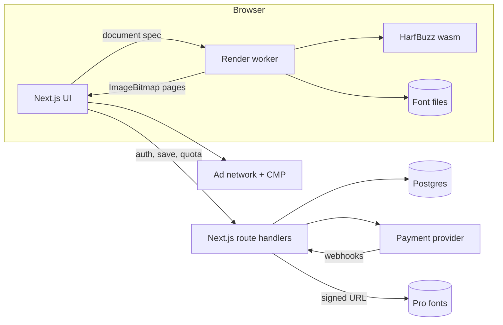

# Truehand: Product & Architecture Spec

**Status:** Draft v1, 25 Sep 2026
**Supersedes:** the pricing model, increments and Hindi scope in [01-requirement-analysis.md](./01-requirement-analysis.md). The problem statement, personas and market analysis there still stand.

---

## 1. What we are building

Truehand turns typed text into pages that look handwritten: real paper, real ink behaviour, and a hand that never writes the same letter twice. It is **free with ads** for everyone and has a **Pro** tier for people who want more styles, better output and no ads.

The rendering engine runs **in the browser**. Text never leaves the device unless the user saves to their account. That keeps serving costs near zero for the free, ad-funded tier, and it is also a privacy promise we can put on the page.

**Positioning:** the most realistic handwriting generator on the web, built for students first and useful to anyone who writes notes, letters or cards.

**Scope decisions**

| Decision | Choice |
|---|---|
| Market | Global, English UI first. Latin script (incl. Latin Extended, Vietnamese and Cyrillic where the style supports it). |
| Hindi / Devanagari | Deferred (owner decision). The engine already shapes any script through HarfBuzz, so adding a script later means adding fonts, not code. |
| Delivery | Everything ships together as one polished product, not staged increments. |

---

## 2. Information architecture

```
/                        Editor-first home: the tool is the hero, content below the fold
/styles                  All handwriting styles, filterable (print, cursive, marker, elegant)
/styles/[id]             Style page: live specimen, character set, best uses, "Write with <name>"
/papers                  Paper gallery
/papers/[id]             Paper page with specimen
/use/[case]              Use-case landing pages: assignments, lab records, Cornell notes,
                         letters, journals, worksheets, thank-you cards…
/my-hand                 Create a style from your own handwriting (Pro)
/pricing                 Plans, passes and add-ons, priced for the visitor's country
/guides, /guides/[slug]  Long-form articles (MDX), written like documentation
/changelog               Shipped work, dated
/account                 Plan, billing portal, credits, saved documents, personal styles
/login                   Google or email code
/about /contact /legal/* Company pages, privacy, terms, refunds, cookies
```

Every public page is server-rendered for search engines. The editor hydrates on the client.

---

## 3. Core experience

1. **Land and write.** The home page opens straight into the editor with a sample page already rendered, so the first paint is the product. Typing re-renders the page live in a Web Worker.
2. **Tune.** Style, paper, pen, size, messiness and slant sit next to the page. Every control shows its effect immediately. Pro items appear in the lists with a small lock and can be **previewed** before paying.
3. **Export.** PDF, PNG or ZIP. The export sheet is where the free limits and Pro upgrades show up, because that is the point where the user already values the result.
4. **Come back.** Documents are saved locally for free users and synced to the account for signed-in users.

Markup stays small and familiar: `# heading`, `- bullet`, `**bold**`, `__underline__`, `~~strike~~`, `==highlight==`, `---` for a new page.

---

## 4. Business model

### 4.1 Revenue streams

| # | Stream | Who pays | Notes |
|---|---|---|---|
| 1 | Display ads | Free users | Google AdSense first; move to Ad Manager or a managed network once traffic qualifies. |
| 2 | **Pro** subscription | Regular users | Monthly or yearly. |
| 3 | **Week Pass** | Deadline users | One-time, 7 days of Pro. For the student who needs it for one assignment. |
| 4 | **Page packs** | Occasional users | One-time credits for pages beyond the free limit. Credits never expire. |
| 5 | **Style unlocks** | Impulse buyers | Buy one Pro style forever, without subscribing. |
| 6 | Later: API and bulk | Businesses | Server-side rendering of the same engine for letters, cards and print. |

### 4.2 Free vs Pro

| | Free (with ads) | Pro |
|---|---|---|
| Handwriting styles | 10 free styles | All 31, plus new ones as they ship |
| Papers | 5 (college, wide, narrow, grid, plain) | All 12 (legal pad, Cornell, dot, engineering, vintage, recycled, kraft…) |
| Pens | 3 ballpoints | Gel, fountain, pencil, marker, custom colour |
| Pages per export | 3 | Unlimited (fair use) |
| Pages per day | 10 | Unlimited |
| Export quality | 150 dpi | 300 dpi |
| Realism controls | Messiness, slant, size | + fatigue, per-effect fine controls, reroll |
| Scan & photo look | Preview only | Export |
| My Hand (own handwriting) | No | Up to 5 personal styles |
| Saved documents | This browser | Synced to account |
| Ads | Yes | None. Ad scripts are not even loaded. |
| Watermark | **None** | None |

No watermark on free exports. Every direct competitor offers watermark-free output, and a watermark would push away the free traffic that pays through ads.

### 4.3 Pricing with purchasing-power tiers

Prices are shown in the visitor's currency and adjusted for their country. The payment provider enforces the price per country, so a VPN changes nothing at checkout.

| Product | Tier A (US, UK, EU-West, CA, AU, JP, SG, Gulf…) | Tier B (BR, MX, TR, PL, MY, ZA, TH…) | Tier C (IN, ID, PH, PK, BD, VN, EG, NG…) |
|---|---|---|---|
| Pro monthly | $6.99 | $3.99 | $1.99 |
| Pro yearly | $39 | $24 | $12 |
| Week Pass | $2.99 | $1.79 | $0.99 |
| Page pack (100 pages) | $2.99 | $1.79 | $0.99 |
| Single style unlock | $1.99 | $1.19 | $0.59 |

These are launch hypotheses. Pricing lives in config, and changes are A/B tested through the provider's price IDs.

### 4.4 Ads without wrecking the product

- Fixed-size slots with reserved space, so there is no layout shift.
- **Editor:** one slot under the controls on desktop and one anchored slot on mobile. Nothing ever covers the page preview.
- **Export sheet:** one slot shown while the export renders. That wait is real, not invented.
- **Content pages:** in-article slots between sections.
- **Never** on pricing, checkout, account, login or legal pages.
- Consent: Google-certified CMP for EEA, UK and Switzerland; non-personalised ads where consent is missing. Users must be 13+ (16+ where local law requires).
- Later: optional rewarded ad ("watch one ad, export this document in HD") through Ad Manager.

### 4.5 Upgrade moments

These are the only places upgrades are pitched. No pop-ups on arrival.
1. Choosing a Pro style, paper or pen: it previews live, and export shows the choice.
2. Export beyond 3 pages, or choosing 300 dpi or the scan/photo look.
3. Hitting the daily limit.
4. Opening My Hand.

---

## 5. Architecture



### 5.1 Stack

| Layer | Choice | Why |
|---|---|---|
| App | Next.js (App Router), React, TypeScript strict | SSR/SSG for SEO, route handlers for the API, one deployable. |
| Styling | CSS Modules + design tokens as CSS custom properties | Full control over a bespoke visual language; no utility-class look. |
| Engine | `@truehand/engine` (this repo) | Framework-free TypeScript. Runs in a Web Worker, on the main thread, or in Node. |
| Shaping | HarfBuzz (wasm) | Correct kerning, ligatures and contextual alternates; any script later. |
| Database | Postgres (Neon) + Drizzle ORM | Serverless-friendly; typed schema and migrations. |
| Auth | Better Auth: Google + email one-time code | Self-hosted, Drizzle adapter, no per-user fees. |
| Payments | Merchant of record (Paddle or Dodo Payments) behind an adapter | They handle global VAT/GST, invoices and per-country prices. See §9. |
| Email | Resend | Login codes and receipts. |
| Hosting | Vercel | Edge geolocation header for regional pricing, CDN for fonts. |
| Analytics | PostHog, cookieless until consent | Funnels for paywall and export conversion. |
| Errors | Sentry | Client, worker and server. |

### 5.2 Engine pipeline

```
text ─► parse markup ─► shape words (HarfBuzz, font fallback, symbol substitutes)
     ─► line breaking on ruled lines ─► pagination
     ─► realism: line tilt, baseline wobble, word/letter jitter, slant,
        smooth warp in word space, fatigue down the page
     ─► display list (filled outlines, drawn lines, highlights)
     ─► canvas: paper tone + tooth, rules, holes ─► ink layer with pen texture
     ─► multiply onto paper ─► optional scan / photo effect ─► PNG / PDF / ZIP
```

- **Deterministic and edit-stable.** Every random choice is a hash of `(seed, block, word text, occurrence)`. Typing in one paragraph never changes the letterforms of another. "Reroll" changes only the seed.
- **Resolution-independent.** Layout is in CSS px. Rendering takes a scale factor: 1× preview, 150 dpi free export, 300 dpi Pro export. Textures are sized in physical units, so grain looks the same at every dpi.
- **Captured hands.** `GlyphSource` also covers glyph sets drawn from a user's own handwriting, with several variants per letter. My Hand and future house styles plug in without changing the layout code.

### 5.3 Data model

```
users(id, email, name, country, created_at)
sessions / accounts / verifications      -- Better Auth tables
subscriptions(id, user_id, provider, provider_ref, plan, status, current_period_end)
passes(id, user_id, expires_at, provider_ref)
credit_ledger(id, user_id, delta, reason, provider_ref, created_at)
style_unlocks(user_id, style_id, provider_ref, created_at)
documents(id, user_id, title, spec jsonb, updated_at)
hands(id, user_id, name, glyphs_url, status, created_at)
export_log(id, user_id | anon_id, pages, dpi, created_at)
webhook_events(id, provider, event_id unique, payload, processed_at)
```

Entitlements are computed, never stored as a flag:
`pro = active subscription OR unexpired pass`, `credits = sum(credit_ledger.delta)`, `styles = free ∪ unlocked ∪ (pro ? all : ∅)`.

### 5.4 Enforcing limits honestly

Free fonts are static files on the CDN. Pro fonts are served through `/api/fonts/[id]`, which checks entitlement and returns a short-lived signed URL. Exports first call `/api/exports` to reserve pages against the daily limit (by account, or an anonymous device ID plus IP for guests) and get the allowed dpi. Rendering happens on the client, so a determined user can get around this, as with every client-side tool. The limits exist to make paying the easy path, not to be uncrackable.

---

## 6. SEO and content

- The home page targets the head term ("text to handwriting") with the working tool above the fold and a real explainer below it.
- **Style, paper and use-case pages** each get a specimen rendered by the engine at build time. Every page has unique, useful copy, not a template with a word swapped.
- **Guides** are written as documentation: how the realism works, how to format lab records, Cornell notes, and so on. They also give ads somewhere to live, and AdSense requires real content before it approves a site.
- Structured data: `SoftwareApplication`, `FAQPage`, `BreadcrumbList`. Sitemap and canonical URLs from the route list.
- Localised UI (es, pt-BR, id, fr, de) comes after launch, with `hreflang`.

---

## 7. Quality bars

| Area | Target |
|---|---|
| LCP (home, mobile, 4G) | < 2.0 s. The first page preview is a pre-rendered image; the live engine takes over after hydration. |
| JS before the editor loads | < 150 KB gzipped. The engine, wasm and fonts load lazily in the worker. |
| Preview re-render | < 120 ms per page on a mid-range phone, debounced while typing. |
| Export, 10 pages at 300 dpi | < 8 s on a laptop, with progress shown. |
| Accessibility | WCAG 2.2 AA. Every control is keyboard reachable; the preview has a text alternative; `prefers-reduced-motion` is respected. |
| Privacy | Text rendered locally. Handwriting samples stored only for signed-in users and deletable. GDPR, UK GDPR and India DPDP compliant policies. |

---

## 8. Design direction

The visual direction will be set from the owner's reference links. Principles that hold either way:

- **The product is the hero.** The rendered page gets the space. Chrome stays quiet.
- **Typography carries the brand.** A deliberate type pairing with a technical, internet-native voice, contrasting with the organic handwriting output.
- **No filler.** No stock gradients, glassmorphism, blanket rounded cards, or sections that only exist to look modern.
- **Copy is specific.** Say what the product does and what each control changes, in plain words.

---

## 9. Decisions needed from the owner

1. **Design references**: the links that define layout, structure, interactions and visual tone.
2. **Payment provider**: this depends on where the business is registered and how payouts work. Paddle and Dodo Payments both act as merchant of record for global sales; confirm which account can be opened.
3. **AdSense**: whether an account exists, or should be applied for once the content pages are live.
4. **Domain**: confirm truehand.app (or the final name) is registered.
